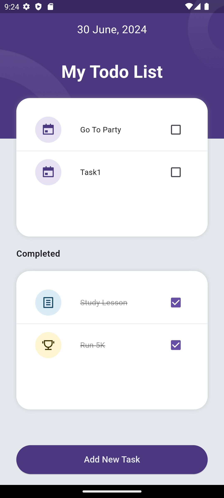
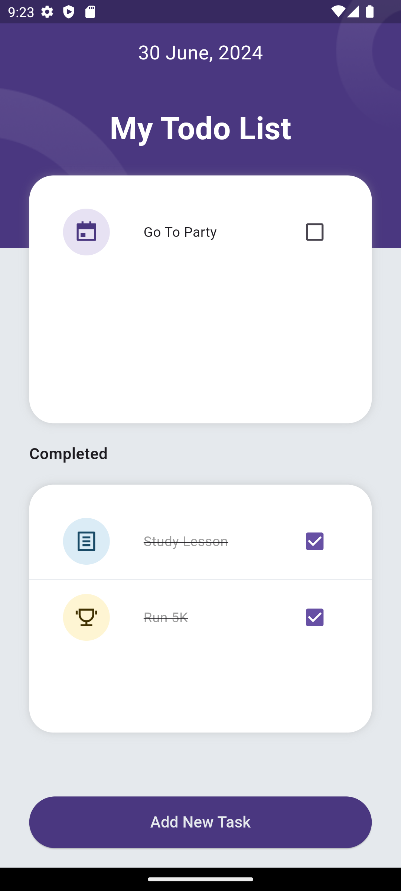
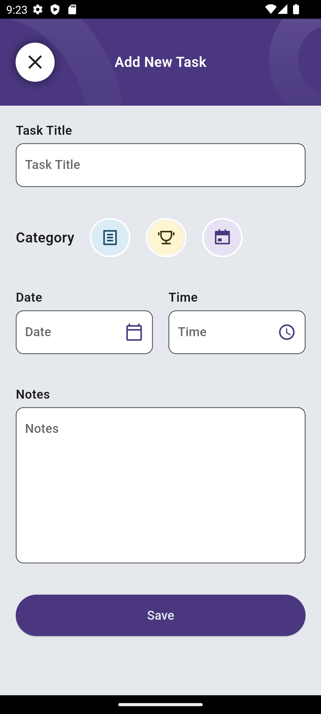
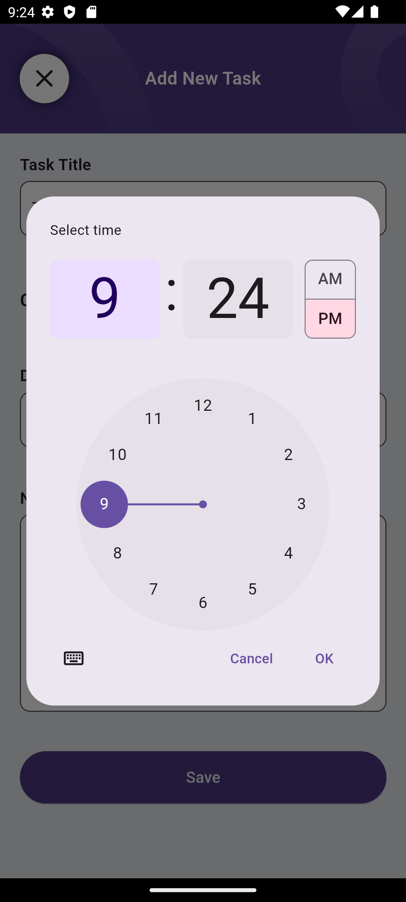
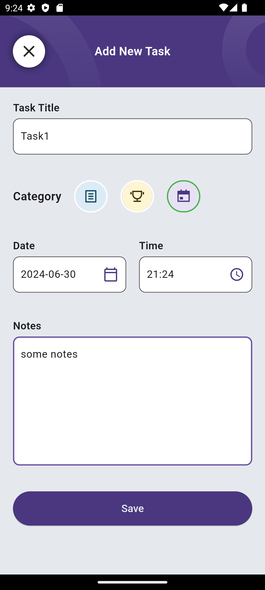

# Todo App

A simple Flutter application for managing tasks.

## Description

Todo App is designed to help users organize their daily tasks efficiently. It allows users to add, edit, and delete tasks with ease. This app utilizes Flutter for cross-platform compatibility.

## Screenshots

## Features

- **Add Tasks**: Add tasks with title, category, date, time, and optional notes.
- **Category Selection**: Choose from predefined categories with icons.
- **Date and Time Selection**: Intuitive pickers for setting task deadlines.
- **Local Storage**: Tasks are stored locally on the device.
- **Responsive UI**: Designed to work seamlessly across different screen sizes.

## Installation

1. Clone the repository:
   https://github.com/Ziraddin/todo_app.git
2. Navigate to the project directory:
   cd todo_app
3. Run the app:
   flutter run

## Dependencies

- `flutter_svg`: For displaying SVG images.
- `provider`: For state management.

## Usage

1. **Adding a Task**:

- Tap on the "+" button to add a new task.
- Enter task details and select a category.

2. **Managing Tasks**:

- View all tasks on the main screen.
- Tap on a task to view details or mark it as complete.

3. **Editing or Deleting Tasks**:

- Long press on a task to edit or delete it.

## Contributing

Contributions are welcome! Fork the repository and submit a pull request with your enhancements.
